# 🌟 EliteStay Hotels — Modern Hotel Booking Web App
A fully responsive, feature-rich hotel booking platform built with HTML, CSS & JavaScript.

<table>
    <tr>
        <td>Desktop View</td>
        <td>Mobile View</td>
    </tr>
    <tr>
        <td>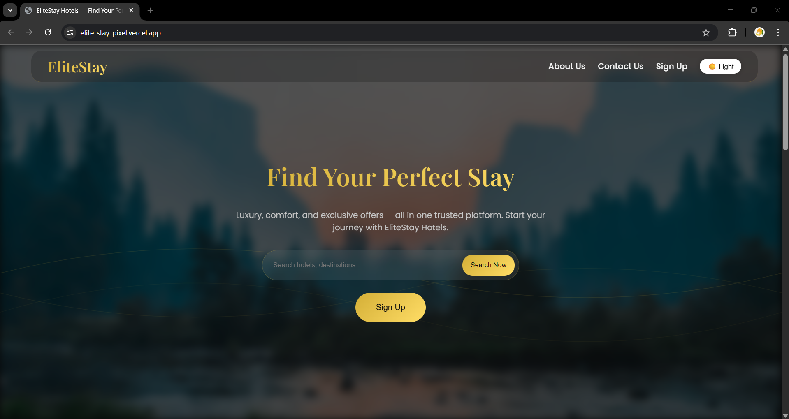</td>
        <td>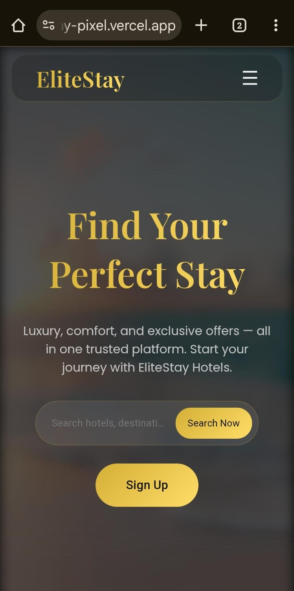</td>
    </tr>
</table>


---

## 🚀 Live Demo
_https://elite-stay-pixel.vercel.app/_

---

## 📖 Table of Contents
- [About the Project](#-about-the-project)
- [Features](#-features)
- [Pages Overview](#-pages-overview)
- [Authentication System](#-authentication-system)
- [Theme Support](#-theme-support)
- [Booking Flow](#-booking-flow)
- [Hotel Comparison](#-hotel-comparison)
- [Tech Stack](#-tech-stack)
- [Project Structure](#-project-structure)
- [How to Run](#-how-to-run)
- [Screenshots](#-screenshots)
- [Future Enhancements](#-future-enhancements)
- [License](#-license)

---

# 🏨 About the Project
**EliteStay Hotels** is a premium, elegant and fully responsive hotel booking website.  
Built using **HTML, CSS, JavaScript**, it includes real-world features:

- Hotel search  
- Hotel comparison  
- Full booking validation  
- LocalStorage authentication  
- Dynamic guest details  
- Theme switching  
- Interactive UI animations  
- Fully mobile friendly design

---

# ✨ Features

## 🔍 1. Advanced Hotel Search
- Search by **hotel name** or **destination**.
- Auto-shows recommended hotels when no match.
- Search query stays in URL for page refresh.

---

## 🏨 2. Detailed Hotel Page
Each hotel page includes:
- Banner background  
- Price per night  
- Available rooms  
- Amenities list  
- Description  
- Smooth scroll to booking section on “Book Now” click  

Dynamic guest system:  
When user enters “3 guests”, 3 guest forms appear with:
- Name  
- Age  
- ID Document upload  

---

## 📅 3. Full Booking System
Includes **all validation checks**:

### ✔ Room Validation  
Cannot exceed available rooms.

### ✔ Check-in Validation  
- Cannot be in the past.

### ✔ Check-out Validation  
- Must be later than check-in.
- Cannot be in the past.

### ✔ Guest Count  
- Must be ≥ 1.

### ✔ Each Guest Must Provide  
- Full Name  
- Age ≥ 1  
- ID Proof  

### ✔ Login Required  
If not logged in → login modal opens automatically.

### ✔ Success Popup  
Shows hotel name, rooms booked, and email confirmation.

---

## 👤 4. Authentication System (LocalStorage Powered)
### Includes:
- **Sign Up**  
- **Sign In**  
- **Profile** modal  
- **Logout**  
- **Delete Account** (password required)  

### Features:
- Error highlighting  
- Green success message for account creation  
- Converts “Sign Up” button → “Profile” dynamically  
- Mobile-friendly scrollable auth modals  

---

## 🌗 5. Light & Dark Mode
- Smooth toggle button  
- Saves user preference  
- Auto adjusts calendar icon colors  
  - White in dark mode  
  - Black in light mode  

---

## 🏨⚖️ 6. Hotel Comparison Tool
- Select first hotel → highlighted  
- Select second hotel → auto redirects to compare page  
- Side-by-side comparison includes:
  - Prices  
  - Images  
  - Rooms  
  - Amenities  
  - Description  
- “Book Now” from compare page goes to hotel details page  

---

## 📩 7. Newsletter Subscription System
- Input validation  
- Inline red error message under field  
- Popup saying:
  “Thank you for subscribing! You will receive hotel deals and travel tips on <email>”

---

## 🍔 8. Responsive Navigation Menu
Desktop:
- About Us 
- Contact Us 
- Profile 
- Theme Toggle 

Mobile:
- All items under hamburger  
- Smooth overlay + animations  
- Auto closing when tapping outside  

---

## ⬆️ 9. Back to Top Button
- Appears after scroll  
- Smooth scrolling  

---

# 📄 Pages Overview

| Page | Description |
|------|-------------|
| `index.html` | Home page with hero slideshow, search, features, testimonials, destinations slider. |
| `hotels.html` | Search results page with recommended hotels. |
| `hotel-details.html` | Complete hotel page with booking system. |
| `compare.html` | Side-by-side comparison of two hotels. |

---

# 🧠 Tech Stack
- **HTML5**
- **CSS3** (advanced gradients, blur effects, responsive grid)
- **JavaScript ES6**
- **LocalStorage** (authentication + theme storage)
- **Unsplash Images** (mock hotel images)

---

# 📁 Project Structure
EliteStay/   
│── index.html  
│── hotels.html  
│── hotel-details.html  
│── compare.html  
│  
├── css/  
│   ├── common.css  
│   ├── home.css  
│   ├── hotels.css  
│   ├── compare.css  
│   └── hotel-details.css  
│  
├── js/  
│   ├── script.js  
│   ├── home.js  
│   ├── hotels.js  
│   ├── hotel-details.js  
│   └── compare.js  
│  
└── assets/    
│   └── screenshots/ 
---

# ▶️ How to Run Locally
1. Clone the repository:
   ```bash
   git clone git@github.com:abheeks-hub/Hotel_Booking_Pixel_Hack.git
2. Open the folder.
3. Run using:
    Open index.html directly  
    OR use VSCode Live Server  
    OR run a local server:  
    ```bash  
    python -m http.server

---

# 📸 Screenshots

## 🏠 Home Page
<table>
    <tr>
        <td>Desktop View</td>
        <td>Mobile View</td>
    </tr>
    <tr>
        <td>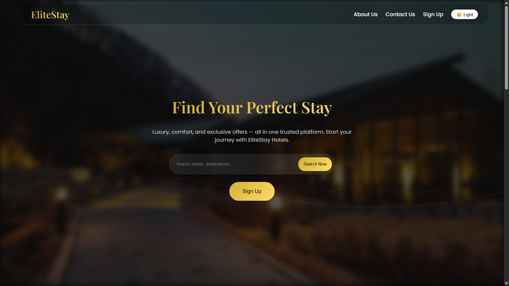</td>
        <td></td>
    </tr>
</table>

## 🔍 Hotel Search Results
<table>
    <tr>
        <td>Desktop View</td>
        <td>Mobile View</td>
    </tr>
    <tr>
        <td>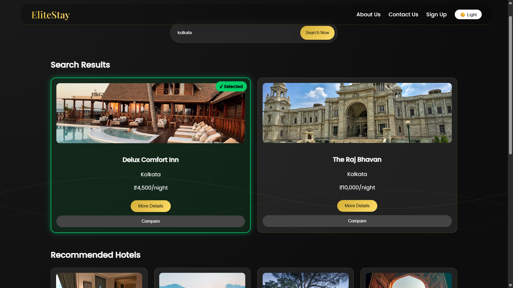</td>
        <td>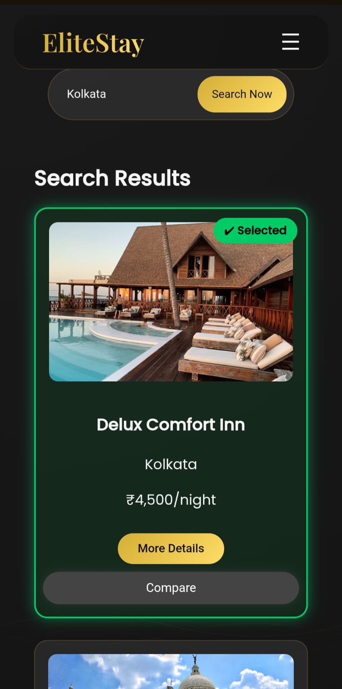</td>
    </tr>
</table>

## 🏨 Hotel Details Page
<table>
    <tr>
        <td>Desktop View</td>
        <td>Mobile View</td>
    </tr>
    <tr>
        <td>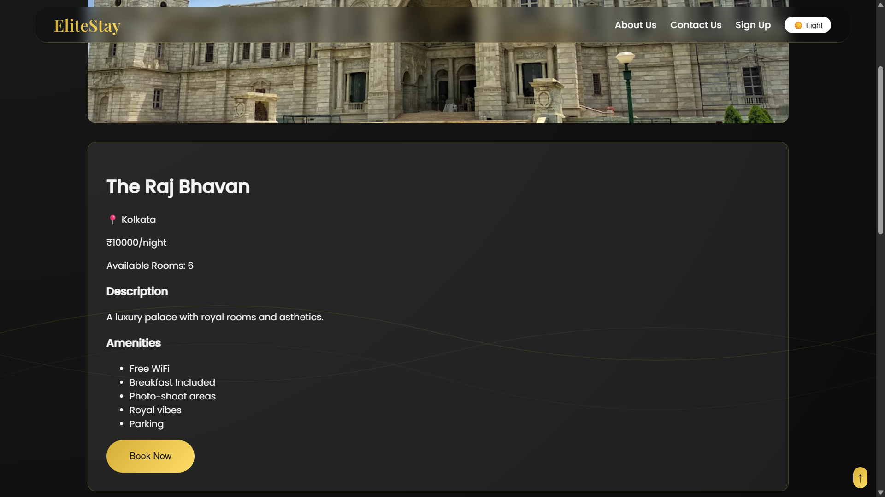</td>
        <td>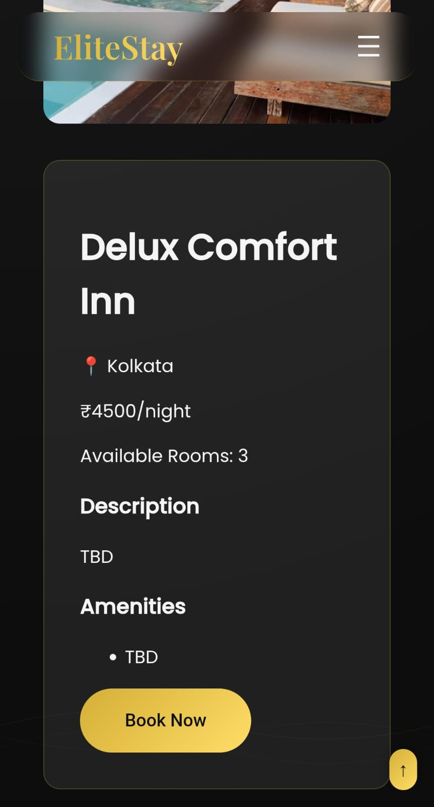</td>
    </tr>
</table>

## 📅 Booking Form
<table>
    <tr>
        <td>Desktop View</td>
        <td>Mobile View</td>
    </tr>
    <tr>
        <td></td>
        <td>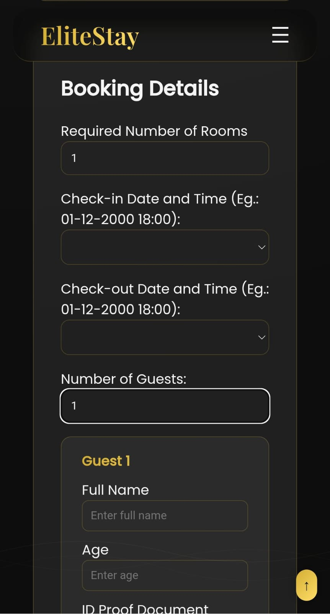</td>
    </tr>
</table>

## ⚖️ Hotel Comparison Page
<table>
    <tr>
        <td>Desktop View</td>
        <td>Mobile View</td>
    </tr>
    <tr>
        <td>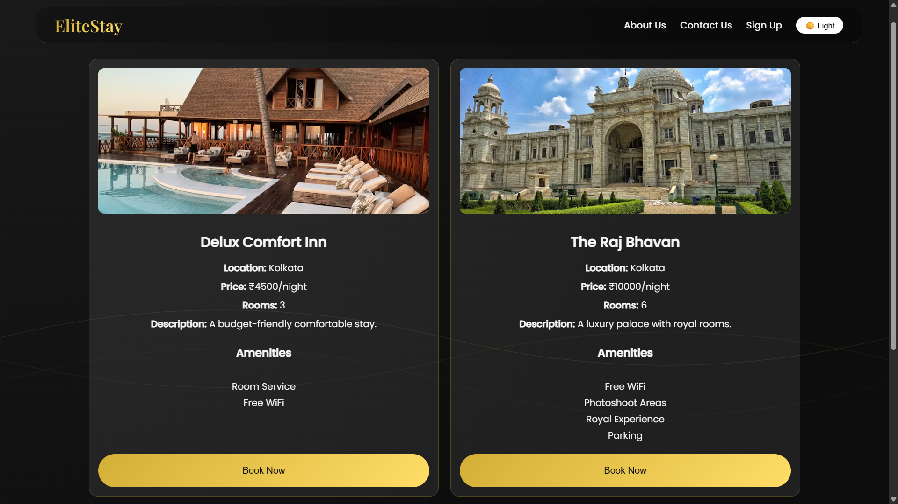</td>
        <td>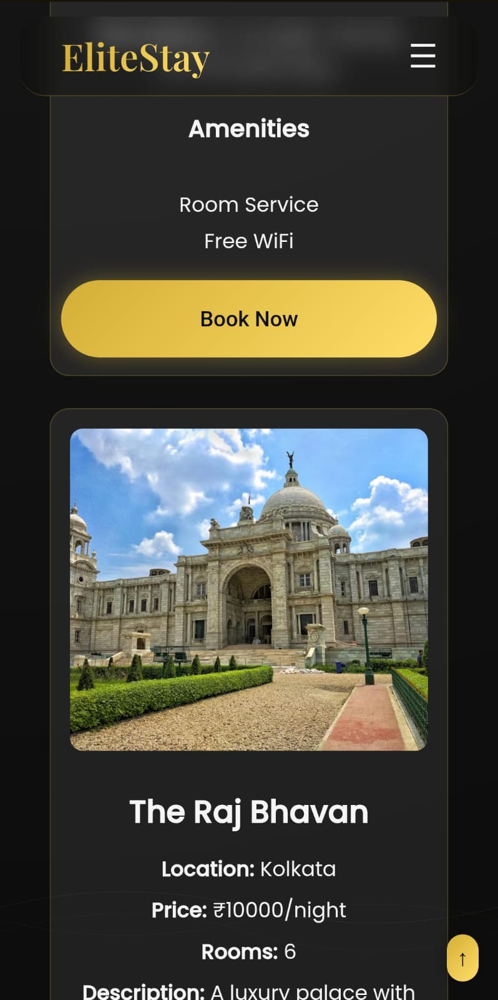</td>
    </tr>
</table>

## 👤 Sign Up & Profile
<table>
    <tr>
        <td>Sign Up</td>
        <td>Profile</td>
    </tr>
    <tr>
        <td>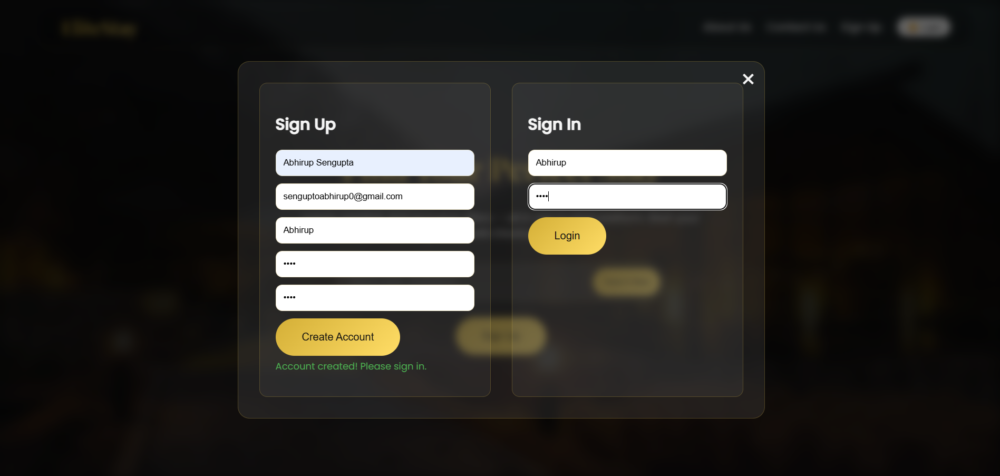</td>
        <td>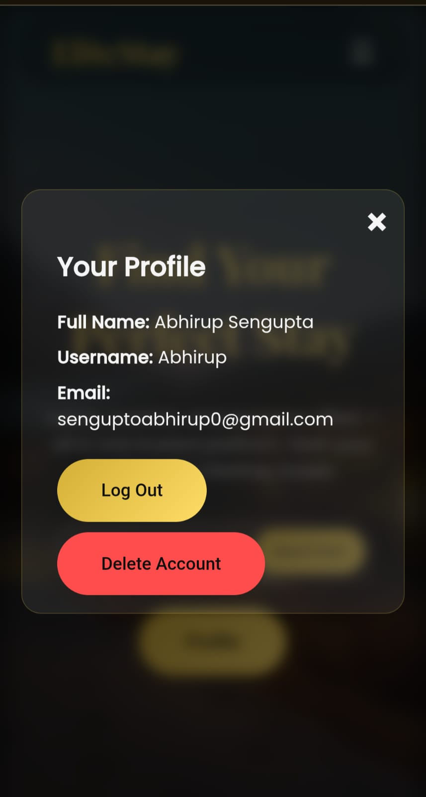</td>
    </tr>
</table>


---

# 🛠 Future Enhancements

- **Add Real Backend**
  - Implement Node.js / Express or Firebase
  - Store bookings, users, and hotels in a real database

- **Online Payment Integration**
  - Razorpay / Stripe checkout for real bookings

- **Advanced Filters & Sorting**
  - Filter hotels by price, amenities, rating, distance
  - Sort by popularity or best deals

- **Rating & Review System**
  - Users can leave star ratings and reviews for hotels

- **User Dashboard**
  - Booking history
  - Downloadable invoices
  - Saved hotels (wishlist)

- **Admin Panel**
  - Add / edit / delete hotels
  - Manage bookings
  - Upload hotel images

- **Add Map Integration**
  - Show hotels on an interactive map (Google Maps / Leaflet)

- **Multi-language Support**
  - English, Hindi, Bengali, etc.

- **Real-time Availability**
  - Update available rooms dynamically based on bookings

- **Email & SMS Notifications**
  - Booking confirmation & reminders

- **Progressive Web App (PWA)**
  - Installable on mobile
  - Offline capabilities

---

# 📜 License

This project is licensed under the **MIT License**.


